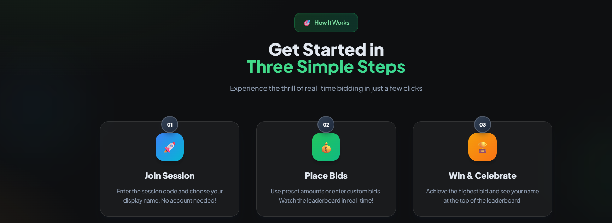
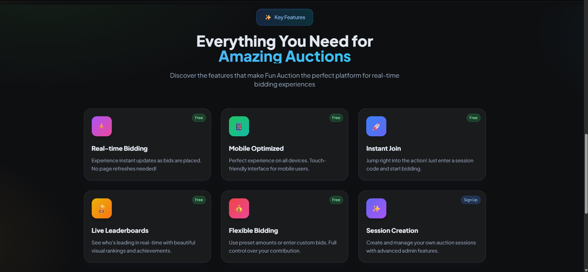
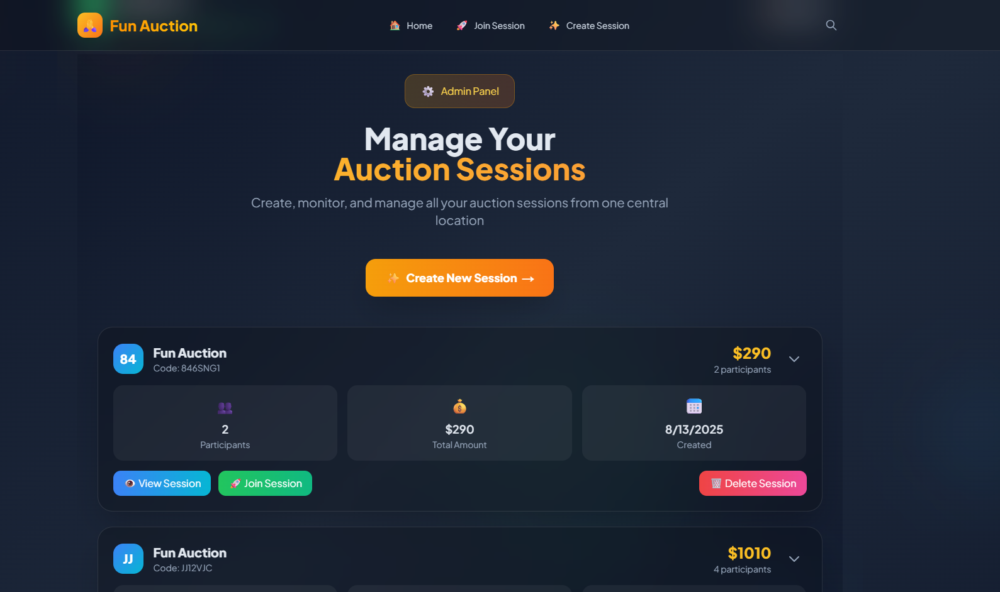

# 🏷️ Fun Auction App

A modern, real-time auction platform built with **Next.js 14** and **Supabase**. Designed for seamless auction management where administrators create sessions and participants join instantly via shared codes without requiring accounts.

---

## ✨ **Current Features**

### 🎯 **Core Auction Functionality**
- **Real-time Bidding**: Instant updates across all participants
- **Custom Amount Input**: Flexible bidding with custom amounts + preset options
- **Session Management**: Create, monitor, and manage auction sessions
- **Participant Tracking**: Real-time participant counts and total amounts
- **Bid History**: Complete audit trail of all bids and contributions

### 👨‍💼 **Admin Panel** (`/admin`)
- **Secure Authentication**: Supabase Email Magic Link login
- **Session Creation**: Create new auction sessions with custom titles
- **Active Sessions Dashboard**: Monitor all ongoing auctions
- **Session Management**: Delete sessions with cascade cleanup
- **Participant Management**: View and remove individual participants
- **Real-time Updates**: Live participant counts and amounts

### 👥 **Public Session Interface** (`/s/[code]`)
- **Instant Join**: No registration required, just enter display name
- **Device-based Sessions**: Unique identification per device
- **Interactive Bidding**: Predefined amounts + custom input
- **Real-time Updates**: Live participant and bid updates
- **Responsive Design**: Mobile-friendly auction experience

---

## 📸 **App Screenshots**

### **👨 Home page interface**






### **👨‍💼 Admin Panel Interface**

*Admin dashboard showing active sessions, participant management, and session controls*

### **👥 End User Auction Interface**

*Public auction session with real-time bidding, participant list, and custom amount input*

> **📝 Note**: Screenshots should be placed in the `docs/` folder. See `docs/README.md` for detailed guidelines on taking and organizing screenshots.

---

## 🛠️ **Technical Architecture**

### **Frontend Stack**
- **Next.js 14**: App Router with TypeScript
- **Tailwind CSS**: Utility-first styling with custom design system
- **Google Fonts**: Plus Jakarta Sans for modern typography
- **Responsive Design**: Mobile-first approach with dark theme

### **Backend Infrastructure**
- **Supabase**: Backend-as-a-Service platform
- **PostgreSQL Database**: Relational database with advanced features
- **Row Level Security (RLS)**: Fine-grained access control
- **Real-time Subscriptions**: WebSocket-based live updates
- **RPC Functions**: Custom PostgreSQL functions for complex operations

### **Database Design**
```sql
-- Core Tables
sessions     → Auction sessions with codes and metadata
participants → Session members with amounts and device IDs
bids         → Individual bid records with timestamps

-- Key Features
- Cascade deletes for data integrity
- Unique constraints (session_id + device_id)
- Comprehensive indexing for performance
- RLS policies for security
```

---

## 🚀 **Getting Started**

### **1. Prerequisites**
- Node.js 18+ and npm/yarn
- Supabase account and project
- Git for version control

### **2. Environment Setup**
```bash
# Clone the repository
git clone <your-repo-url>
cd FunAuction---ReactApp

# Install dependencies
npm install

# Set up environment variables
cp env.example .env.local
```

### **3. Supabase Configuration**
```bash
# Required environment variables
NEXT_PUBLIC_SUPABASE_URL=your_supabase_url
NEXT_PUBLIC_SUPABASE_ANON_KEY=your_supabase_anon_key
```

### **4. Database Setup**
```bash
# Run the complete schema in Supabase SQL Editor
# File: src/supabase/master_schema.sql
# This creates all tables, policies, and RPC functions
```

### **5. Development**
```bash
# Start development server
npm run dev

# Open http://localhost:3000
# Admin panel: http://localhost:3000/admin
```

---

## 📱 **User Experience Flow**

### **Admin Workflow**
1. **Login** → Visit `/admin` and authenticate via magic link
2. **Create Session** → Generate new auction with custom title
3. **Monitor** → View real-time participant counts and amounts
4. **Manage** → Delete sessions or remove specific participants
5. **Share** → Distribute session codes to participants

### **Participant Workflow**
1. **Join Session** → Enter session code from admin
2. **Enter Name** → Provide display name (no account needed)
3. **Start Bidding** → Use preset amounts or custom values
4. **Real-time Updates** → See live changes across all devices
5. **Track Progress** → Monitor personal and total amounts

---

## 🔧 **Key Technical Features**

### **RPC Functions (Supabase)**
- `join_session()`: Handle participant creation/updates
- `place_bid()`: Process bids with validation
- `get_session_details()`: Fetch complete session data

### **Security & Performance**
- **RLS Policies**: Database-level access control
- **Cascade Deletes**: Automatic cleanup of related data
- **Optimized Queries**: N+1 query prevention
- **Real-time Subscriptions**: Efficient WebSocket updates

### **State Management**
- **React Hooks**: useState, useEffect, useMemo
- **Optimistic Updates**: Immediate UI feedback
- **Error Handling**: Comprehensive error management
- **Loading States**: User feedback during operations

---

## 🎨 **Design System**

### **Color Palette**
```css
--neon: #00ff88          /* Primary accent */
--border: #334155        /* Subtle borders */
--background: #0f172a    /* Dark theme base */
```

### **Typography**
- **Font Family**: Plus Jakarta Sans (Google Fonts)
- **Responsive Sizing**: Mobile-first scale system
- **Accessibility**: High contrast and readable text

### **Component Library**
- **Custom Buttons**: Consistent styling across the app
- **Card Components**: Unified content containers
- **Modal System**: Interactive overlays for custom inputs
- **Responsive Grid**: Adaptive layouts for all screen sizes

---

## 🔍 **Recent Improvements**

### **v2.0 - Participant Management**
- ✅ Admin can delete individual participants
- ✅ Cascade cleanup of participant data
- ✅ Real-time participant list updates
- ✅ Enhanced error handling and logging

### **v1.9 - Custom Amount Bidding**
- ✅ Modal-based custom amount input
- ✅ Validation and error handling
- ✅ Consistent button styling
- ✅ Keyboard navigation support

### **v1.8 - RPC Architecture**
- ✅ Replaced complex RLS with RPC functions
- ✅ Simplified database security model
- ✅ Better performance and maintainability
- ✅ Comprehensive error handling

---

## 🚧 **Development Status**

### **✅ Completed Features**
- [x] Admin authentication and session management
- [x] Real-time auction sessions with participants
- [x] Custom amount bidding system
- [x] Participant management (view/delete)
- [x] Session deletion with cascade cleanup
- [x] Responsive design and mobile optimization
- [x] Comprehensive error handling
- [x] Database schema and RPC functions

### **🔄 In Progress**
- [ ] Additional admin analytics and reporting
- [ ] Enhanced participant verification
- [ ] Advanced session configuration options

### **📋 Future Roadmap**
- [ ] Multi-session management
- [ ] Advanced bidding rules
- [ ] Export and reporting features
- [ ] Mobile app development

---

## 🐛 **Troubleshooting**

### **Common Issues**
1. **Participant Deletion Not Working**
   - Ensure RLS policies are properly set in Supabase
   - Check admin authentication status
   - Verify database permissions

2. **Real-time Updates Not Working**
   - Check Supabase real-time subscriptions
   - Verify environment variables
   - Check browser console for errors

3. **Session Creation Fails**
   - Ensure admin is properly authenticated
   - Check Supabase RLS policies
   - Verify database table structure

---

## 📄 **License**

This project is licensed under the MIT License - see the [LICENSE](LICENSE) file for details.

---

## 🤝 **Contributing**

1. Fork the repository
2. Create a feature branch (`git checkout -b feature/amazing-feature`)
3. Commit your changes (`git commit -m 'Add amazing feature'`)
4. Push to the branch (`git push origin feature/amazing-feature`)
5. Open a Pull Request

---

## 📞 **Support**

For support and questions:
- Create an issue in the repository
- Contact the development team
- Check the troubleshooting section above

---

**Built with ❤️ using Next.js and Supabase**
