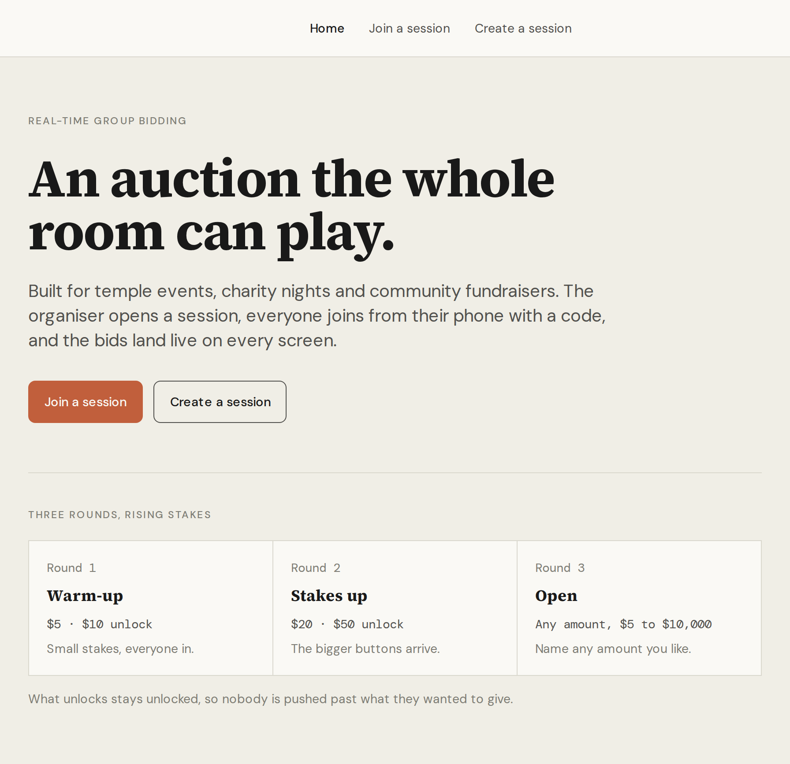
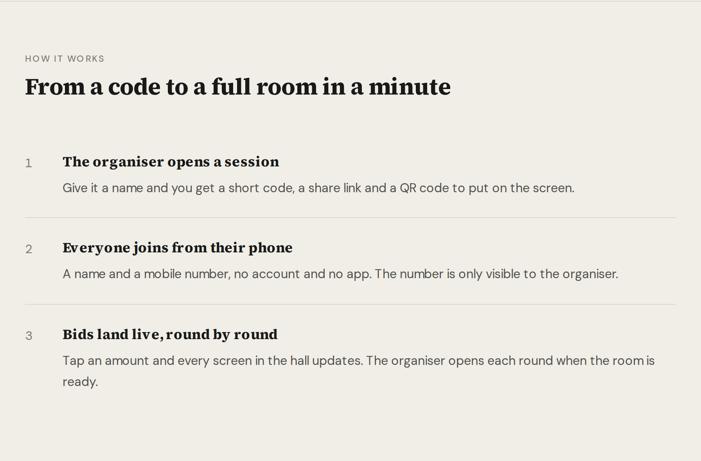
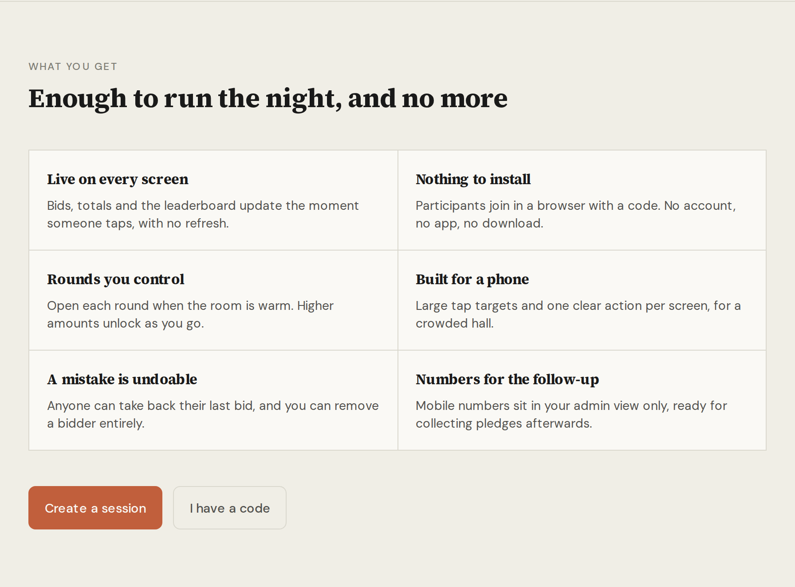
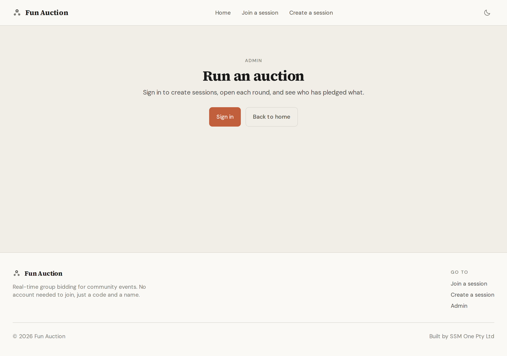
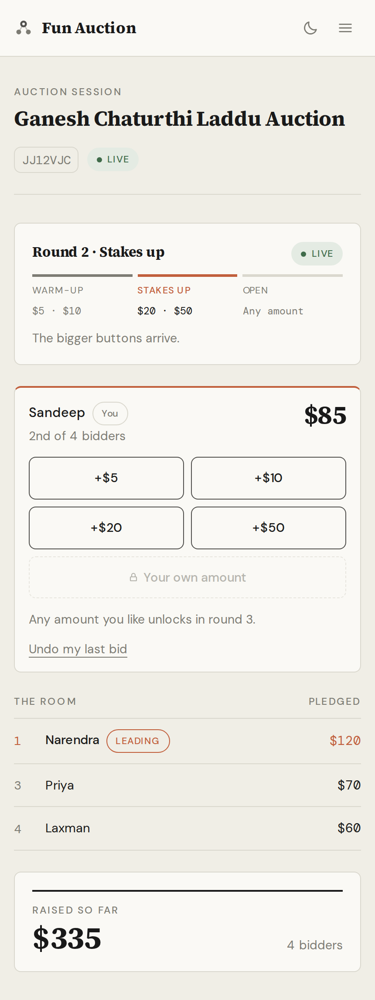

# 🏷️ Fun Auction App

A modern, real-time auction platform built with **Next.js 14** and **Supabase**. Designed for seamless auction management where administrators create sessions and participants join instantly via shared codes without requiring accounts.

---

## ✨ **Current Features**

### 🎯 **Core Auction Functionality**
- **Three-round bidding**: Higher amounts unlock as the organiser opens each round
- **Real-time Bidding**: Instant updates across all participants
- **Custom Amount Input**: Free-text amounts, available once round 3 opens
- **Session Management**: Create, monitor, and manage auction sessions
- **Participant Tracking**: Real-time participant counts and total amounts
- **Bid History**: Complete audit trail of all bids and contributions

### 🔢 **The round ladder**

Each round keeps everything earlier rounds unlocked, so nobody is pushed past
what they wanted to give.

| Round | Name | Unlocks | Buttons available |
|-------|------|---------|-------------------|
| 1 | Warm-up | $5, $10 | $5, $10 |
| 2 | Stakes up | $20, $50 | $5, $10, $20, $50 |
| 3 | Open | any amount | all presets, plus $5–$10,000 free text |

The organiser advances rounds from `/admin`. Every joined phone updates over
Supabase realtime without a refresh. The ladder is enforced in the database by
`place_bid()`, so hiding buttons in the browser is a convenience, not the
control.

**Bidders never see what a later round unlocks.** They see the rounds exist,
locked, but not the amounts behind them. The reveal is what keeps the room
engaged, and it stops people holding back in round 1 because they are saving
for a bigger button they can see coming. Only the admin view lists every round's
amounts.

### 👨‍💼 **Admin Panel** (`/admin`)
- **Secure Authentication**: Supabase Email Magic Link login
- **Session Creation**: Create new auction sessions with custom titles
- **Active Sessions Dashboard**: Monitor all ongoing auctions
- **Session Management**: Delete sessions with cascade cleanup
- **Participant Management**: View and remove individual participants
- **Real-time Updates**: Live participant counts and amounts

### 👥 **Public Session Interface** (`/s/[code]`)
- **Instant Join**: No registration required, just enter display name
- **Device-based Sessions**: Unique identification per device
- **Interactive Bidding**: Predefined amounts + custom input
- **Real-time Updates**: Live participant and bid updates
- **Responsive Design**: Mobile-friendly auction experience

---

## 📸 **App Screenshots**

### **👨 Home page interface**






### **👨‍💼 Admin Panel Interface**

*Admin sign-in. Once signed in you get session cards with round control, bidder lists and mobile numbers*

### **👥 End User Auction Interface**

*A bidder's phone during round 2. The $20 and $50 tiers have just appeared; round 3 shows as locked with its amounts hidden*

> **📝 Note**: Screenshots live in the `docs/` folder. See `docs/README.md` for guidelines on taking and organizing them.

---

## 🛠️ **Technical Architecture**

### **Frontend Stack**
- **Next.js 14**: App Router with TypeScript
- **Tailwind CSS**: Utility-first styling over the SSM One token set
- **Google Fonts**: DM Sans, Source Serif 4 and DM Mono via `next/font`
- **Responsive Design**: Mobile-first, light "paper" theme with a navy dark theme

### **Backend Infrastructure**
- **Supabase**: Backend-as-a-Service platform
- **PostgreSQL Database**: Relational database with advanced features
- **Row Level Security (RLS)**: Fine-grained access control
- **Real-time Subscriptions**: WebSocket-based live updates
- **RPC Functions**: Custom PostgreSQL functions for complex operations

### **Database Design**
```sql
-- Core Tables
sessions     → Auction sessions with codes and metadata
participants → Session members with amounts and device IDs
bids         → Individual bid records with timestamps

-- Key Features
- Cascade deletes for data integrity
- Unique constraints (session_id + device_id)
- Comprehensive indexing for performance
- RLS policies for security
```

---

## 🚀 **Getting Started**

### **1. Prerequisites**
- Node.js 18+ and npm/yarn
- Supabase account and project
- Git for version control

### **2. Environment Setup**
```bash
# Clone the repository
git clone <your-repo-url>
cd FunAuction---ReactApp

# Install dependencies
npm install

# Set up environment variables
cp env.example .env.local
```

### **3. Supabase Configuration**
```bash
# Required environment variables
NEXT_PUBLIC_SUPABASE_URL=your_supabase_url
NEXT_PUBLIC_SUPABASE_ANON_KEY=your_supabase_anon_key
```

### **4. Database Setup**

**New Supabase project?** Run one file and you are done:

```
src/supabase/complete_setup.sql
```

Paste the whole thing into the Supabase SQL Editor and press Run. It creates the
tables, indexes, RLS policies and every RPC function, and it puts all three
tables on the `supabase_realtime` publication — which is what makes bids land
live and lets an opened round reach every phone without a refresh. It ends with
a verification query; every row should read `OK`.

It is safe to run more than once, so if a run is interrupted, just run it again.

**Existing database from before rounds?** Run `src/supabase/rounds_migration.sql`
instead. It adds only what rounds need and leaves your data alone.

`master_schema.sql` is the older pre-rounds setup file, kept for reference.
`complete_setup.sql` supersedes it.

Then, still in the dashboard:

- **Settings → API**: copy the Project URL and the `anon` public key into
  `.env.local`.
- **Authentication → Providers → Email**: enable Email, since the organiser
  signs in with a magic link.
- **Authentication → URL Configuration**: add your site URL, and
  `http://localhost:3000` for local testing, to the redirect allow list.

### **5. Development**
```bash
# Start development server
npm run dev

# Open http://localhost:3000
# Admin panel: http://localhost:3000/admin
```

---

## 📱 **User Experience Flow**

### **Admin Workflow**
1. **Login** → Visit `/admin` and authenticate via magic link
2. **Create Session** → Generate new auction with custom title
3. **Monitor** → View real-time participant counts and amounts
4. **Manage** → Delete sessions or remove specific participants
5. **Share** → Distribute session codes to participants

### **Participant Workflow**
1. **Join Session** → Enter session code from admin
2. **Enter Name** → Provide display name (no account needed)
3. **Start Bidding** → Use preset amounts or custom values
4. **Real-time Updates** → See live changes across all devices
5. **Track Progress** → Monitor personal and total amounts

---

## 🔧 **Key Technical Features**

### **RPC Functions (Supabase)**
- `join_session()`: Handle participant creation/updates
- `place_bid()`: Process bids, rejecting any amount the current round does not allow
- `get_session_details()`: Fetch complete session data, including `current_round`
- `set_session_round()`: Advance or rewind the round. Granted to `authenticated`
  only, so a participant cannot open a round for themselves
- `undo_last_bid()`: Remove a participant's most recent bid
- `amount_allowed_in_round()`: The round gate itself, mirrored in
  `src/lib/constants.ts` for the UI

### **Security & Performance**
- **RLS Policies**: Database-level access control
- **Cascade Deletes**: Automatic cleanup of related data
- **Optimized Queries**: N+1 query prevention
- **Real-time Subscriptions**: Efficient WebSocket updates

### **State Management**
- **React Hooks**: useState, useEffect, useMemo
- **Optimistic Updates**: Immediate UI feedback
- **Error Handling**: Comprehensive error management
- **Loading States**: User feedback during operations

---

## 🎨 **Design System**

The app uses the **SSM One Pty Ltd** brand system. Every colour is a CSS
variable in `src/app/globals.css`, so the light and dark themes swap without
duplicating component styles.

### **Color Palette (light "paper" theme)**
```css
--paper:    #F0EEE6   /* page ground */
--ivory:    #FAF9F5   /* cards, nav, panels */
--cloud:    #E5E3D9   /* button hover fill */
--accent:   #C15F3C   /* live round, leader, primary action */
--ink:      #191919   /* headings, amounts */
--ink-2:    #52514E   /* body text, button borders */
--ink-3:    #7D7C74   /* meta, locked tiers */
--hairline: #DAD8CE   /* rules and dividers */
```

The dark theme redefines the same tokens in SSM One's navy, intended for the
hall projector. It follows the OS preference by default and is toggled from the
nav; the choice is remembered in `localStorage`.

### **Typography**
- **Source Serif 4**: headings and money
- **DM Sans**: interface text, labels and buttons
- **DM Mono**: session codes and columns of figures, with tabular numerals

### **Component Classes**
`.card`, `.card-own`, `.btn` (with `.btn-primary`, `.btn-ghost`, `.btn-quiet`,
`.btn-danger`, `.btn-locked`), `.field`, `.pill`, `.label`, `.num`, `.display`.

---

## 🔍 **Recent Improvements**

### **v3.0 - Rounds and the SSM One theme**
- ✅ Three-round bidding ladder, enforced in the database
- ✅ Admin round control, with the change reaching every phone over realtime
- ✅ Later rounds stay hidden from bidders until the organiser opens them
- ✅ Rebuilt on the SSM One brand system: paper light theme, navy dark theme
- ✅ Removed the gradient and emoji-driven UI in favour of type and hairlines

### **v2.0 - Participant Management**
- ✅ Admin can delete individual participants
- ✅ Cascade cleanup of participant data
- ✅ Real-time participant list updates
- ✅ Enhanced error handling and logging

### **v1.9 - Custom Amount Bidding**
- ✅ Modal-based custom amount input
- ✅ Validation and error handling
- ✅ Consistent button styling
- ✅ Keyboard navigation support

### **v1.8 - RPC Architecture**
- ✅ Replaced complex RLS with RPC functions
- ✅ Simplified database security model
- ✅ Better performance and maintainability
- ✅ Comprehensive error handling

---

## 🚧 **Development Status**

### **✅ Completed Features**
- [x] Admin authentication and session management
- [x] Real-time auction sessions with participants
- [x] Custom amount bidding system
- [x] Participant management (view/delete)
- [x] Session deletion with cascade cleanup
- [x] Responsive design and mobile optimization
- [x] Comprehensive error handling
- [x] Database schema and RPC functions

### **🔄 In Progress**
- [ ] Additional admin analytics and reporting
- [ ] Enhanced participant verification
- [ ] Advanced session configuration options

### **📋 Future Roadmap**
- [ ] Multi-session management
- [ ] Advanced bidding rules
- [ ] Export and reporting features
- [ ] Mobile app development

---

## 🐛 **Troubleshooting**

### **Common Issues**
1. **Participant Deletion Not Working**
   - Ensure RLS policies are properly set in Supabase
   - Check admin authentication status
   - Verify database permissions

2. **Real-time Updates Not Working**
   - Check Supabase real-time subscriptions
   - Verify environment variables
   - Check browser console for errors

3. **Session Creation Fails**
   - Ensure admin is properly authenticated
   - Check Supabase RLS policies
   - Verify database table structure

---

## 📄 **License**

This project is licensed under the MIT License - see the [LICENSE](LICENSE) file for details.

---

## 🤝 **Contributing**

1. Fork the repository
2. Create a feature branch (`git checkout -b feature/amazing-feature`)
3. Commit your changes (`git commit -m 'Add amazing feature'`)
4. Push to the branch (`git push origin feature/amazing-feature`)
5. Open a Pull Request

---

## 📞 **Support**

For support and questions:
- Create an issue in the repository
- Contact the development team
- Check the troubleshooting section above

---

**Built with ❤️ using Next.js and Supabase**
